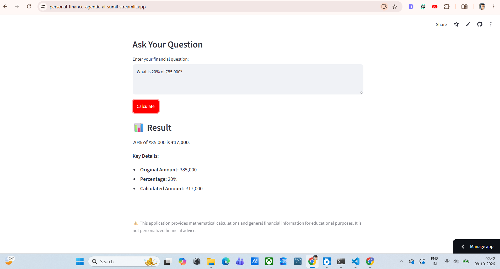
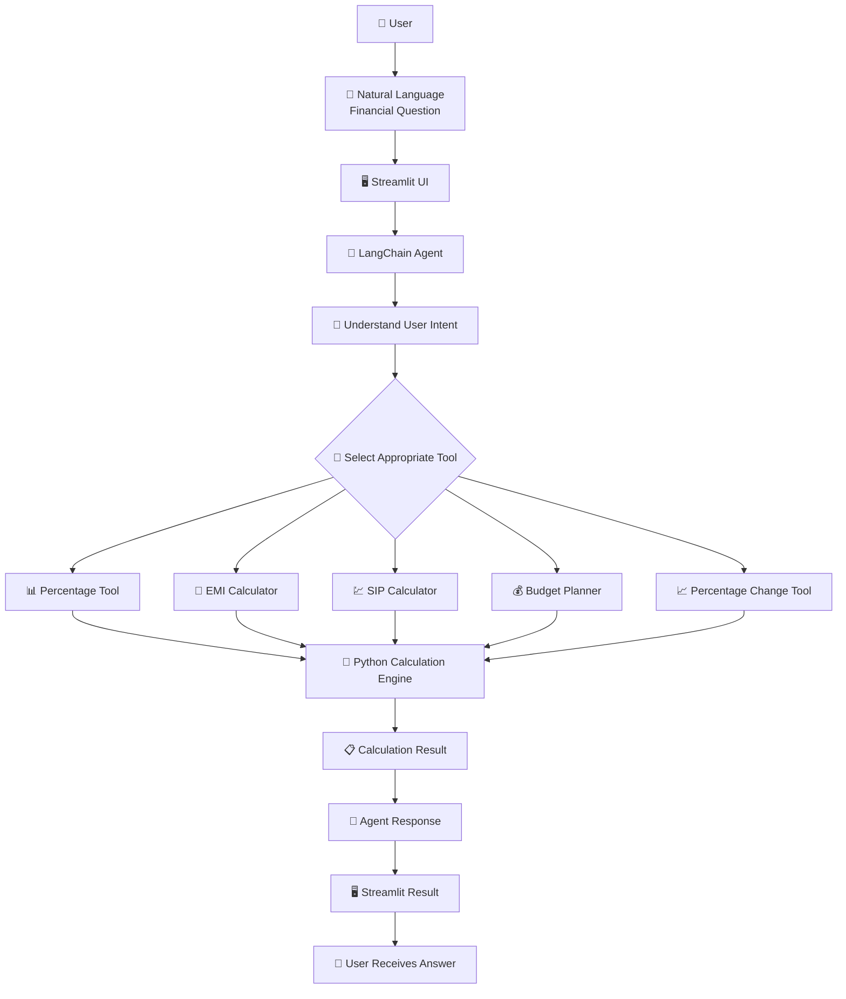

# 💰 Personal Finance AI Agent

An **Agentic AI-powered Personal Finance Assistant** built with **Python, LangChain, Gemini 3.5 Flash, and Streamlit**.

The application allows users to ask financial calculation questions using **natural language**. Instead of manually selecting a calculator, the LangChain agent understands the user's request and automatically selects the appropriate financial tool to generate the result.

🔗 **Live Application:**  
[https://personal-finance-agentic-ai-sumit.streamlit.app/](https://personal-finance-agentic-ai-sumit.streamlit.app/)

---

## 📌 Project Overview

Managing common financial calculations often requires using different calculators for different purposes.

For example:

- EMI requires a loan repayment formula.
- SIP requires an investment future-value calculation.
- Budget planning requires income allocation.
- Percentage calculations require basic mathematical operations.

This project combines these calculations with an **AI Agent** that can understand natural-language questions and automatically decide which tool should be used.

Instead of asking users to select:

> EMI Calculator → Enter Amount → Enter Interest → Enter Tenure

the user can simply ask:

> **"Calculate EMI for a ₹10 lakh loan at 8% annual interest for 20 years."**

The AI Agent identifies the intent and invokes the appropriate **EMI Calculator Tool**.

---

# 🚀 Live Demo

### 🌐 Try the Application

👉 [**Open Personal Finance AI Agent**](https://personal-finance-agentic-ai-sumit.streamlit.app/)

The application is deployed using **Streamlit Community Cloud**.

---

# 🖥️ Application Screenshots

## 🏠 Application Interface


The application provides a simple interface where users can enter financial questions in natural language.

---

## 📊 Financial Calculation Result



The application displays the calculated result along with important calculation details.

---

# 🎯 Project Objectives

The main objectives of this project are:

- Build a practical **Agentic AI application**.
- Understand how **LLM Agents interact with tools**.
- Implement deterministic financial calculation tools using Python.
- Allow users to interact with financial calculations using natural language.
- Demonstrate **tool calling** using LangChain.
- Integrate **Gemini 3.5 Flash** as the LLM.
- Build a user-friendly interface using Streamlit.
- Deploy the complete application to the cloud.
- Follow secure API-key management practices.

---

# 🤖 What Makes This an Agentic AI Application?

This project is not simply an LLM chatbot.

The application uses an **AI Agent + Tools architecture**.

The LLM receives the user's natural-language request and determines which tool should handle the task.

### Example
# 💬 Example Use Cases & Questions

The **Personal Finance AI Agent** can understand financial questions written in natural language and automatically select the appropriate financial calculation tool.

Users can ask questions related to **percentage calculations, percentage changes, loan EMI, SIP future value, and 50/30/20 budgeting**.

---

## 📊 1. Percentage Calculations

Calculate a percentage of an amount.

### Example Questions

- What is 20% of ₹85,000?
- Calculate 15% of ₹50,000.
- What is 25% of ₹1,00,000?
- How much is 10% of ₹75,000?
- Calculate 30% of ₹2,00,000.
- What is 5% of ₹10,000?
- Find 12.5% of ₹80,000.
- How much is 7.5% of ₹1,20,000?
- Calculate 18% of ₹90,000.
- What is 40% of ₹2,50,000?
- Calculate 22% of ₹1,50,000.
- What is 35% of ₹60,000?
- Find 8% of ₹1,00,000.
- Calculate 12% of ₹2,00,000.
- What is 50% of ₹75,000?

### Example

**Question:**

> What is 20% of ₹85,000?

**Result:**

> ₹17,000

---

# 📈 2. Percentage Change Calculations

Calculate the percentage increase or decrease between two values.

### Example Questions

- My investment increased from ₹50,000 to ₹65,000. What is the percentage change?
- A product price increased from ₹20,000 to ₹25,000. What is the percentage increase?
- My savings increased from ₹80,000 to ₹1,00,000. What is the percentage change?
- The price changed from ₹50,000 to ₹45,000. What is the percentage change?
- My investment went from ₹1,00,000 to ₹1,20,000. Calculate the percentage increase.
- An amount decreased from ₹75,000 to ₹60,000. What is the percentage change?
- My salary increased from ₹40,000 to ₹50,000. What is the percentage increase?
- My monthly expenses increased from ₹30,000 to ₹36,000. What is the percentage change?
- My investment decreased from ₹2,00,000 to ₹1,80,000. What is the percentage change?
- A product price dropped from ₹50,000 to ₹45,000. What is the percentage decrease?
- My savings increased from ₹1,00,000 to ₹1,25,000. What is the percentage increase?
- My income increased from ₹60,000 to ₹72,000. Calculate the percentage change.

### Example

**Question:**

> My investment increased from ₹50,000 to ₹65,000. What is the percentage change?

**Result:**

> 30% increase

---

# 🏦 3. Loan EMI Calculations

Calculate the monthly EMI for different types of loans using the principal amount, annual interest rate, and loan tenure.

### Basic EMI Questions

- Calculate EMI for a ₹10,00,000 loan at 8% annual interest for 20 years.
- What will be the EMI for a ₹5,00,000 loan at 10% interest for 5 years?
- Calculate the monthly EMI for a ₹20 lakh loan at 8.5% interest for 15 years.
- What is the EMI for a ₹15,00,000 loan at 9% annual interest for 10 years?
- Calculate EMI for a ₹25 lakh loan at 8% interest for 20 years.
- What will be my monthly EMI for a ₹12 lakh loan at 9% interest for 10 years?
- Calculate the EMI for a ₹7,50,000 loan at 10% interest for 7 years.
- What is the monthly payment for a ₹18 lakh loan at 8.5% interest for 15 years?
- Calculate EMI for a ₹30 lakh loan at 9% interest for 20 years.
- What is the EMI for a ₹40 lakh loan at 8% interest for 25 years?

---

## 🏠 Home Loan Examples

- Calculate EMI for a ₹30 lakh home loan at 8.5% interest for 20 years.
- What will be my monthly EMI for a ₹50 lakh home loan at 8% for 25 years?
- Calculate the EMI on a ₹40,00,000 home loan at 9% annual interest for 15 years.
- What is the monthly payment for a ₹35 lakh home loan at 8.5% for 20 years?
- Calculate EMI for a ₹60 lakh home loan at 8% interest for 20 years.
- What will be the EMI for a ₹45 lakh home loan at 9% interest for 15 years?
- Calculate the monthly EMI for a ₹25 lakh home loan at 8.5% for 20 years.

---

## 🚗 Car & Vehicle Loan Examples

- Calculate EMI for a ₹10 lakh car loan at 9% interest for 5 years.
- What is the EMI for a ₹7,00,000 vehicle loan at 10% interest for 5 years?
- Calculate my monthly EMI for a ₹5 lakh car loan at 9.5% for 4 years.
- What will be the EMI for a ₹12 lakh car loan at 9% interest for 6 years?
- Calculate EMI for a ₹15 lakh vehicle loan at 10% interest for 5 years.
- What is the monthly EMI for a ₹8 lakh car loan at 9% for 5 years?

---

## 🎓 Education Loan Examples

- Calculate EMI for a ₹5 lakh education loan at 8% interest for 7 years.
- What is the monthly EMI for a ₹10 lakh education loan at 9% for 10 years?
- Calculate EMI for a ₹7 lakh education loan at 8.5% for 8 years.
- What will be the EMI for a ₹12 lakh education loan at 9% interest for 10 years?
- Calculate the monthly payment for a ₹4 lakh education loan at 8% for 5 years.

---

## 💳 Personal Loan Examples

- Calculate EMI for a ₹5 lakh personal loan at 11% interest for 5 years.
- What is the EMI for a ₹3 lakh personal loan at 12% interest for 3 years?
- Calculate the monthly EMI for a ₹8 lakh personal loan at 10.5% for 5 years.
- What will be the EMI for a ₹10 lakh personal loan at 12% interest for 7 years?
- Calculate EMI for a ₹2 lakh personal loan at 11% for 2 years.

### Example

**Question:**

> Calculate EMI for a ₹10,00,000 loan at 8% annual interest for 20 years.

**Inputs:**

| Parameter | Value |
|---|---:|
| Principal | ₹10,00,000 |
| Annual Interest Rate | 8% |
| Tenure | 20 years |

**Result:**

> **Monthly EMI ≈ ₹8,364.40**

---

# 💹 4. SIP Investment Future Value

Calculate the estimated future value of regular monthly SIP investments using the monthly investment, annual return rate, and investment duration.

> **Note:** SIP results are mathematical projections based on the assumed return rate. Actual investment returns are not guaranteed.

### Basic SIP Questions

- If I invest ₹7,000 every month for 15 years at 10% annual return, what will be the future value?
- What will be the future value if I invest ₹5,000 every month for 10 years at 10% annual return?
- If I invest ₹10,000 monthly for 20 years at 12% annual return, what will be the future value?
- Calculate the future value of a ₹3,000 monthly SIP for 5 years at 8% annual return.
- What will ₹15,000 monthly investment become after 15 years at 10% annual return?
- Calculate the future value of ₹8,000 monthly investment for 10 years at 10% annual return.
- If I invest ₹12,000 every month for 15 years at 11% annual return, what will be the future value?
- What will ₹20,000 monthly investment become after 20 years at 10% annual return?

---

## 📈 Long-Term SIP Examples

- If I invest ₹5,000 every month for 20 years at 10% annual return, what will be the future value?
- Calculate the future value of ₹10,000 monthly investment for 25 years at 12% annual return.
- If I invest ₹20,000 every month for 15 years at 10% annual return, what will be the future value?
- What will ₹8,000 monthly investment become after 20 years at 11% annual return?
- Calculate the future value of ₹15,000 monthly for 25 years at 10% annual return.
- If I invest ₹25,000 every month for 20 years at 12% annual return, what will be the future value?

---

## 💵 Small SIP Investment Examples

- What will happen if I invest ₹1,000 every month for 10 years at 10% annual return?
- Calculate the future value of ₹2,000 monthly for 5 years at 8% annual return.
- If I invest ₹3,000 every month for 10 years at 10% annual return, what will be the future value?
- What will ₹5,000 per month become after 15 years at 10% annual return?
- Calculate the future value of ₹2,500 monthly for 10 years at 10% annual return.
- If I invest ₹4,000 every month for 15 years at 12% annual return, what will be the future value?

### Example

**Question:**

> If I invest ₹7,000 every month for 15 years at 10% annual return, what will be the future value?

**Inputs:**

| Parameter | Value |
|---|---:|
| Monthly Investment | ₹7,000 |
| Annual Return | 10% |
| Investment Period | 15 years |

**Estimated Future Value:**

> **₹29,01,292.42**

---

# 💰 5. 50/30/20 Budget Planning

Create a basic monthly budget using the 50/30/20 budgeting framework.

| Category | Allocation |
|---|---:|
| 🏠 Needs | 50% |
| 🎯 Wants | 30% |
| 💰 Savings | 20% |

### Basic Budget Questions

- My monthly income is ₹90,000. Create a 50/30/20 budget.
- I earn ₹60,000 per month. Create a 50/30/20 budget.
- My monthly salary is ₹1,00,000. Divide it using the 50/30/20 rule.
- I earn ₹75,000 per month. Create a monthly budget using the 50/30/20 rule.
- My monthly income is ₹50,000. Show me a 50/30/20 budget.
- I earn ₹80,000 per month. Divide my income using the 50/30/20 rule.
- My salary is ₹70,000. Create a 50/30/20 budget.

---

## 💵 Higher Income Budget Examples

- My monthly income is ₹1,50,000. Create a 50/30/20 budget.
- I earn ₹2,00,000 per month. Divide my income using the 50/30/20 rule.
- My salary is ₹1,20,000. How much should go toward needs, wants, and savings?
- I earn ₹1,80,000 per month. Create a 50/30/20 budget.
- My monthly income is ₹2,50,000. Divide it using the 50/30/20 rule.
- I earn ₹1,10,000 per month. Show me my needs, wants, and savings allocation.

---

## 💵 Lower Income Budget Examples

- I earn ₹30,000 per month. Create a 50/30/20 budget.
- My monthly salary is ₹40,000. Divide it into needs, wants, and savings.
- I earn ₹25,000 per month. Show me a 50/30/20 budget.
- My monthly income is ₹35,000. Create a 50/30/20 budget.
- I earn ₹45,000 per month. Divide my salary using the 50/30/20 rule.

### Example

**Question:**

> My monthly income is ₹90,000. Create a 50/30/20 budget.

**Result:**

| Category | Percentage | Amount |
|---|---:|---:|
| 🏠 Needs | 50% | ₹45,000 |
| 🎯 Wants | 30% | ₹27,000 |
| 💰 Savings | 20% | ₹18,000 |
| **Total** | **100%** | **₹90,000** |

---

# 🔢 6. Mixed Financial Scenarios

The agent can be used for different everyday financial calculation scenarios.

### Salary & Savings

- I earn ₹90,000 per month. What is 20% of my income?
- My salary is ₹75,000. What is 30% of my income?
- I earn ₹1,00,000. How much is 50% of my salary?
- What is 10% of ₹80,000?
- Calculate 25% of my ₹1,20,000 salary.

### Investment Growth

- My investment increased from ₹1,00,000 to ₹1,25,000. What is the percentage change?
- My investment went from ₹2,00,000 to ₹2,50,000. Calculate the percentage increase.
- My savings increased from ₹50,000 to ₹70,000. What is the percentage change?
- My investment decreased from ₹1,00,000 to ₹90,000. What is the percentage change?

### Loan Planning

- I want to take a ₹20 lakh loan at 8.5% for 15 years. What will be my monthly EMI?
- What is the EMI for a ₹30 lakh loan at 8% for 20 years?
- Calculate EMI for a ₹15 lakh loan at 9% for 10 years.
- What will be my monthly EMI for a ₹5 lakh loan at 10% for 5 years?

### Investment Planning

- I want to invest ₹10,000 every month for 15 years at 10%. What will be the future value?
- If I invest ₹5,000 every month for 20 years at 12%, what will be the future value?
- What will ₹15,000 monthly become after 10 years at 10% annual return?
- Calculate the future value of ₹3,000 monthly for 5 years at 8%.

### Budget Planning

- I earn ₹90,000 per month. Create a 50/30/20 budget.
- My salary is ₹1,00,000. How much should I allocate to needs, wants, and savings?
- I earn ₹60,000. Show me my 50/30/20 budget.
- My monthly income is ₹1,50,000. Divide it using the 50/30/20 rule.

---

# 🤖 7. Natural-Language Questions

The agent is designed to understand different natural-language variations of financial questions.

### Percentage

- What is 20% of ₹85,000?
- Calculate 20 percent of ₹85,000.
- How much is 20 percent of ₹85,000?
- Find 20% of ₹85,000.
- Calculate twenty percent of ₹85,000.

### EMI

- Calculate EMI for a ₹10 lakh loan at 8% for 20 years.
- What would my monthly payment be for ₹10 lakh at 8% for 20 years?
- If I borrow ₹10 lakh at 8% for 20 years, what is my EMI?
- How much would I pay every month for a ₹10 lakh loan at 8% for 20 years?

### SIP

- If I invest ₹7,000 every month for 15 years at 10%, what will I have?
- What will ₹7,000 monthly become after 15 years at 10%?
- Calculate the future value of a ₹7,000 monthly investment for 15 years at 10%.
- If I invest ₹7,000 per month for 15 years, how much could it grow to at 10%?

### Budget

- I earn ₹90,000. Create a 50/30/20 budget.
- How should I divide my ₹90,000 salary using the 50/30/20 rule?
- I make ₹90,000 every month. Show me my needs, wants, and savings.
- Divide my ₹90,000 monthly income into needs, wants, and savings.

---

# 🧩 8. Agent Tool Selection Examples

The AI Agent automatically determines which financial tool is appropriate for each question.

| User Question | Tool Selected |
|---|---|
| What is 20% of ₹85,000? | Percentage Calculator |
| Calculate 15% of ₹50,000. | Percentage Calculator |
| My investment increased from ₹50,000 to ₹65,000. What is the percentage change? | Percentage Change Calculator |
| My savings went from ₹80,000 to ₹1,00,000. What is the percentage change? | Percentage Change Calculator |
| Calculate EMI for ₹10 lakh at 8% for 20 years. | EMI Calculator |
| What is the EMI for a ₹20 lakh loan at 8.5% for 15 years? | EMI Calculator |
| If I invest ₹7,000 every month for 15 years at 10%, what will be the future value? | SIP Calculator |
| What will ₹10,000 monthly become after 20 years at 12%? | SIP Calculator |
| My monthly income is ₹90,000. Create a 50/30/20 budget. | Budget Planner |
| I earn ₹1,00,000. Divide my salary using the 50/30/20 rule. | Budget Planner |

# 👤 Author
**Sumit Ghodke**
Aspiring AI Engineer / Data Science Professional focused on building practical AI applications using Python, Machine Learning, NLP, Generative AI, LangChain, and Agentic AI.

**Skills Demonstrated in This Project**
- Python
- SQL
- Data Analytics
- Machine Learning
- Deep Learning
- NLP
- Generative AI
- LangChain
- Agentic AI
- LLM Integration
- Streamlit
- Git
- GitHub
- Cloud Deployment


# 🔄 Agentic Workflow

The application follows an **Agent + Tools architecture**, where the LangChain Agent understands the user's financial question and automatically selects the appropriate calculation tool.



### Example Flow

```text
User Question
      ↓
Streamlit UI
      ↓
LangChain Agent
      ↓
Understand Intent
      ↓
Select Financial Tool
      ↓
Python Calculation
      ↓
Agent Response
      ↓
Streamlit Result
```

### Example

**User asks:**

> Calculate EMI for a ₹10,00,000 loan at 8% annual interest for 20 years.

The agent identifies the request as an **EMI calculation**, selects the **EMI Calculator**, passes the required parameters to the Python calculation function, and returns the calculated EMI through the Streamlit interface.

**Result:**

> Monthly EMI ≈ ₹8,364.40


